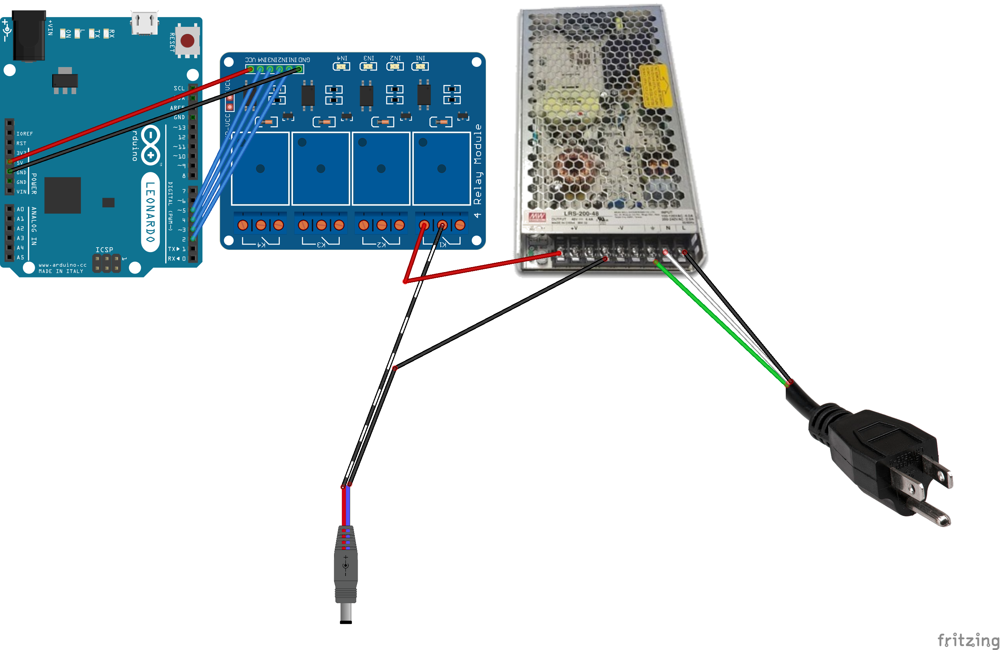

Building a Arduino Power Controller in FreeBSD
==============================================
*~7 minute read*

Objective and Background
----------------------
This post explains how the Arduino power controller was built. This power controller was intended to be used in the Hardware CI system for power cycling devices after modified versions of FreeBSD were installed for network booting. The important aspects of this system are that it is easy to use, easy to extend and can handle concurrent calls from Jenkins jobs.

Tools and Requirements
----------------------
All required code is available in the Github repository: https://github.com/GeraldNDA/devpowerd.

### Starter Kit
 * Arduino Leonardo (with Headers)
     * Any Arduino that has 8 (digital) GPIOs and can utilize a serial connection can work.
 * 10 Male to Female Jumper wires
     * Assorted colors are better w/ 8 of some color(s), 1 red and 1 black
 * Micro-USB to USB cable
 * Power supply cable
     * Cut and stripped to expose the leads
 * 1 - 8 pieces of wire
 * 1 - 8 power connections (DC-jack, micro USB, etc.)
     * Cut and stripped to expose the leads
     * Most 5V devices use 3.5mm/1.5mm Barrel Connectors or micro-USB
 * Power supply unit
     * Suggested 5V and at least 3A per device
     * i.e. 5V, 40A for 8 devices (make sure you have enough current for each device)
 * A computer with FreeBSD installed
 * 8-Relay Module
     * similar to [this model](https://www.sainsmart.com/products/8-channel-5v-relay-module)
 * 1 - 8 devices
     * i.e. Pine A64-LTS

### Packages
 * Arduino IDE (`devel/arduino18`)
     * As this is the newest version (at the time of writing), you may find some issues with this package. If so, try`devel/arduino` and be sure to let the port maintainer know about any issues.
 * Python 3 (`lang/python3`)
     * Used for the power controller server and client
 * Conserver (`comms/conserver-com`)
     > **DANGER**
     > 
     > DO NOT install `comms/conserver` it is an older version.

     * This is used instead of `comms/py-serial` in order to alias the ports and to allow use over the network. If you do not need either of these features, you can modify the scripts to use that interface instead. See [pySerial Documentation](https://pyserial.readthedocs.io/) for more information.
 * Pexpect `misc/py-pexpect`
     * Used to interface with the conserver. `lang/expect` is another good option but requires using TCL.
     * When installing python packages using `pkg` you should install the flavor you want like so: `sudo pkg install py36-pexpect` to install the Pexpect for Python 3.6. If using ports then use `make FLAVOR=py36 install`.

Getting Started
---------------
First, you may want to make sure that your setup is working correctly. You can do this by connecting the micro-usb to USB connection from the Arduino to the computer. And ensure that you can successfully program it with the Example "Blink" program.

Hardware Setup
--------------
Below is a schematic of the connection between the components.
 For 12V devices you may need a separate power supply or a step-up voltage regulator.
> **NOTE**
>
> There are some differences between this schematic and what you might implement. Including:
> * The image below shows a 4-relay module however the code below uses an 8-relay module. The additional inputs are connected from pins 6 to 9.
> * Additional devices can be attached, but only one is shown below.
> * A DC Barrel power connection (For a Pine A64-LTS) is shown, however, any 5V power connection can be used instead (i.e. Micro-USB or USB power connections).



Programming the Arduino
-----------------------
The code required to program the Arduino is available [here](https://github.com/GeraldNDA/devpowerd/blob/master/ci_relay_controller.ino)
> **NOTE**
> 
> The majority of the help text is unnecessary (i.e. `device_list` and print outs) but can be helpful for verifying that the serial port used is indeed the power controller or for manually testing the arduino code. Additionally, the use of `EOT` in the script below is not necessary as it mostly is helpful when the serial port is interfaced directly (i.e. using pySerial).


You should be able to program this code directly to the Arduino.

Configure Conserver
-------------------
Conserver configurations are included in the repository for both the [remote computer](https://github.com/GeraldNDA/devpowerd/blob/master/distconserver.cf.sample) and the [local computer](https://github.com/GeraldNDA/devpowerd/blob/master/localconserver.cf.sample) which has the serial connection. You should place these files into `/usr/local/etc/conserver.cf` on the respective computer.

Additional Tips:
  * If the Jenkins is running on the same computer where the serial connections are, then the local configurations should be sufficient. The `access` block is not required.
 * You can modify `/etc/hosts` to create an alias for another computer. This means you can have a nice name for that computer in the `conserver.cf` file. Adding the following line to the remote computer aliases a computer with IP `192.186.10.10` to `consolehost`:
     ```
     192.168.11.149		consolehost
     ```
 * New devices should be consoles named `slot#` where `#` matches the number of the relay (from 1 to 8, inclusive) it is attached to. An alias can be used to have a nicer device name i.e. `pinea64`.
 * Building `conserver` manually from source allows you to specify a different default `master`. If you do so, then you don't need to run conserver (or use a `conserver.cf`) on the remote computer.

Additionally, you'll want to create `/usr/local/etc/conserver.passwd` with the following contents to allow yourself and the root user to access the console without logging in.
> **NOTE**
> 
> You'll also want to add the `jenkins` user for use in the HW CI system. This only needs to be done on the computer where Jenkins is running.

```
root:
<your_username>:
```

To enable and start the conserver run the following:
```bash
sudo sysrc conserver_enable=YES
sudo service conserver start
```

Power Controller Server
-----------------------
### Server Python Script

The power controller server script is available [here](https://github.com/GeraldNDA/devpowerd/blob/master/devpowerd.py). This file opens a socket (default is 9009) and listens for operations to send to the Arduino.

Make sure to run `sudo chmod +x /usr/local/devpowerd/devpowerd.py` so that it can be run as a program.

### Serial Interface Script

The serial interface script is available [here](https://github.com/GeraldNDA/devpowerd/blob/master/devpowerserial.py). This script can be run from the command line but can also provide a python interface to the serial controller(s).

> **WARNING**
> 
> At the time of writing, you must specify the "master" computer (with the physical serial connections attached) for it to work correctly. This script manages translating the device name to a slot number by checking `console -x` however  This is not a concern if everything is running on the localhost.


After translating the device name to a slot number, it will send the command and device number to the Arduino and verify the response.

If you wish to run this script as a program, then don't forget to run `chmod +x`

### RC Script

Create a `/usr/local/etc/rc.d/devpowerd` by copying in [this file](https://github.com/GeraldNDA/devpowerd/blob/master/devpowerd). This exposes the devpowerd script  as a service. When the service is running, logs will be written to `${devpowerd_log}`.

Again, this script requires a `chmod +x`

To enable and run this daemon, run the following:
```bash
sudo sysrc devpowerd_enable=YES
sudo service devpowerd start
```
Power Controller Client
-----------------------
The power controller client script is available [here](https://github.com/GeraldNDA/devpowerd/blob/master/devpowerd.py). This script is used for communicating with the daemon service. This script takes the command line arguments, sends them to the daemon service and returns the response.

This script also requires a `chmod +x`

In order to run this script easier, it should be added to the PATH. An easy way to do this is
to add a symbolic link to it in `/usr/local/bin`
```bash
ln -s /usr/local/devpower/devpowerctl.py /usr/local/bin/devpowerctl
```


At this point, you can  run `devpowerctl <command> <device_name>` from any directory. For example, `devpowerctl turn_on pinea64` turns on the device, and `devpowerctl turn_off pinea64` turns off the device.
